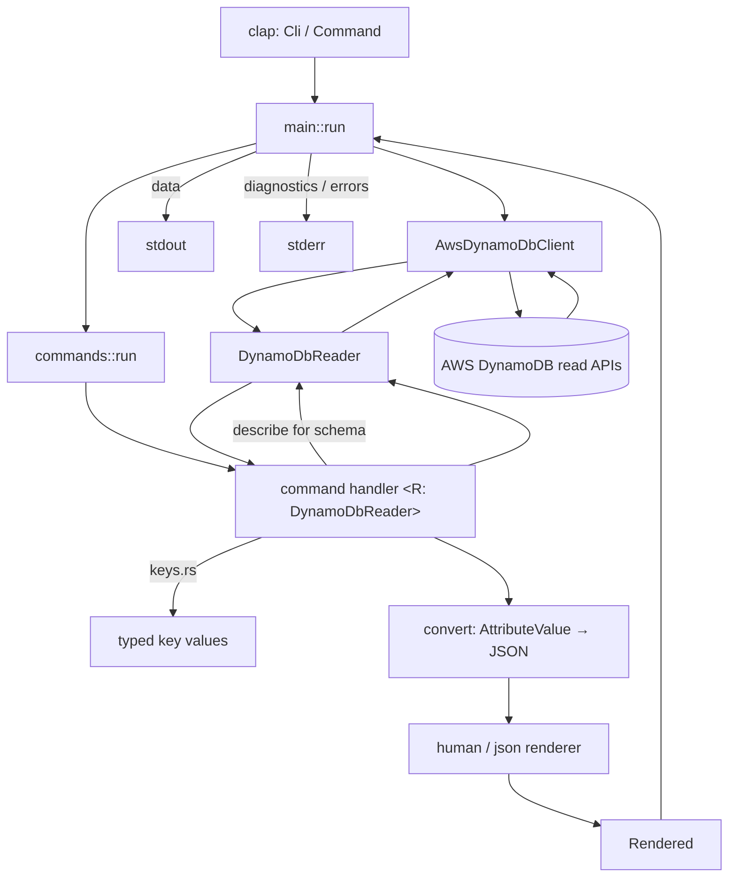

# Architecture

## Purpose

`ddb` is a fast, terminal-native, **strictly read-only** DynamoDB inspection CLI
for developers. It performs only DynamoDB read operations and can never mutate
DynamoDB data or table configuration.

## Directory layout

```
ddb/
├── Cargo.toml
├── Cargo.lock
├── README.md
├── src/
│   ├── main.rs            # entry point: parse → build client → dispatch → print → exit code
│   ├── lib.rs            # library root; re-exports modules; documents the safety guarantee
│   ├── cli.rs            # clap CLI definition (Cli + Command + ShellKind)
│   ├── error.rs         # DdbError, exit codes, AWS SDK error mapping
│   ├── keys.rs          # schema-aware key-argument parsing & typing
│   ├── active.rs        # active-table resolution ($DDB_TABLE, venv-style)
│   ├── picker.rs        # interactive fuzzy table picker + TTY detection
│   ├── commands/
│   │   ├── mod.rs        # Rendered type + dispatch (run) + table resolution
│   │   ├── tables.rs     # list, or interactive pick
│   │   ├── use_table.rs  # `use`: activate/pick a table
│   │   ├── shell.rs      # `shell-init`: emit shell integration
│   │   ├── describe.rs   # describe + indexes
│   │   ├── get.rs
│   │   ├── query.rs
│   │   └── scan.rs
│   ├── dynamodb/
│   │   ├── mod.rs        # DynamoDbReader trait + domain types (the safety boundary)
│   │   ├── client.rs     # AwsDynamoDbClient: AWS-backed, read-only impl
│   │   └── convert.rs    # AttributeValue → serde_json::Value
│   └── output/
│       ├── mod.rs        # OutputFormat enum
│       ├── human.rs      # human-readable rendering
│       └── json.rs       # JSON rendering
├── tests/
│   ├── no_write_path.rs  # enforces: no DynamoDB write operations in src/
│   ├── commands.rs       # end-to-end handler tests with an in-memory fake reader
│   └── aws_config.rs     # shared config/credentials file resolution
└── docs/
```

## Module responsibilities

- **`cli`** — declares the CLI surface with clap derive. Global flags
  (`--profile`, `--region`, `--output`) are available before or after the
  subcommand. The `[table]` positional is optional on data commands (resolved
  against the active table). Custom `--max-pages` parser enforces a minimum of 1.
- **`active`** — the active-table session model. `resolve_table(explicit)`
  applies the precedence *explicit arg > `$DDB_TABLE` > usage error*; the dispatch
  in `commands::run` calls it before every table command.
- **`picker`** — the interactive fuzzy picker (`dialoguer::FuzzySelect`, UI drawn
  on stderr) and `is_interactive()` TTY gating so scripted use stays plain.
- **`commands::shell`** — emits the `ddb` shell function + prompt integration for
  `shell-init`; **`commands::use_table`** — the `use` handler (activate by name or
  pick). Neither performs writes.
- **`dynamodb`** — the load-bearing safety boundary. The `DynamoDbReader` trait
  exposes only reads: `list_tables`, `describe_table`, `get_item`, `query`,
  `scan`. Domain types (`TableSchema`, `KeySchema`, `KeyDef`, `ScalarType`,
  request/`Page` types, `Item`) are AWS-SDK-adjacent but read-only.
- **`dynamodb::client`** — `AwsDynamoDbClient` implements `DynamoDbReader` using
  `aws-sdk-dynamodb`, calling read APIs only. Handles pagination for all reads
  and builds `KeyConditionExpression`s with placeholder names/values. The free
  function `load_config` centralizes AWS configuration loading via the standard
  chain (env, `~/.aws/credentials`, `~/.aws/config`, SSO, IAM-role/metadata),
  with optional `--profile`/`--region` overrides.
- **`dynamodb::convert`** — total conversion of `AttributeValue` into JSON with
  deterministic (sorted) key order and precision-safe number handling.
- **`keys`** — parses `--pk`/`--sk` arguments (bare or `name=value`) and types
  them per the discovered schema (`S`/`N`/`B`).
- **`commands`** — handlers generic over `R: DynamoDbReader`. Each returns a
  `Rendered { stdout, stderr }` value; it never prints directly, so the
  stdout/stderr split lives solely in `main`.
- **`output`** — `human` and `json` renderers. Pure functions returning
  `String`, which makes them unit-testable.
- **`error`** — `DdbError` with stable exit codes and machine codes; maps AWS
  SDK errors into actionable categories without leaking secrets.
- **`main`** — the only place that touches real stdout/stderr and process exit
  codes; the only place that constructs the AWS-backed client.

## Data flow



## The read-only boundary

Commands are generic over `R: DynamoDbReader`. That trait has no mutating
method, so a handler *cannot* call a write API — it has no name to call. The
only concrete implementation, `AwsDynamoDbClient`, invokes only read operations.
`tests/no_write_path.rs` scans `src/` and fails the build if any mutating
DynamoDB SDK operation (e.g. `put_item`, `delete_table`, PartiQL
`execute_statement`) appears anywhere.

## Key handling

`get` and `query` first call `describe_table` to learn the key schema, then use
`keys::resolve_key_arg` to type each supplied value. `name=value` is
disambiguated from values that merely contain `=` (e.g. base64 padding) by
checking the left side against the table's key attribute names. Query key
conditions are built with expression-attribute placeholders (`#pk`/`:pk`) to
avoid reserved-word collisions.

## Pagination

- `tables`: follows `LastEvaluatedTableName` to completion.
- `query`/`scan`: `--limit` is the per-page cap sent to DynamoDB; `--max-pages`
  bounds how many pages are fetched. If pages remain when the cap is hit, the
  `Page.truncated` flag is set and a stderr warning is emitted.
